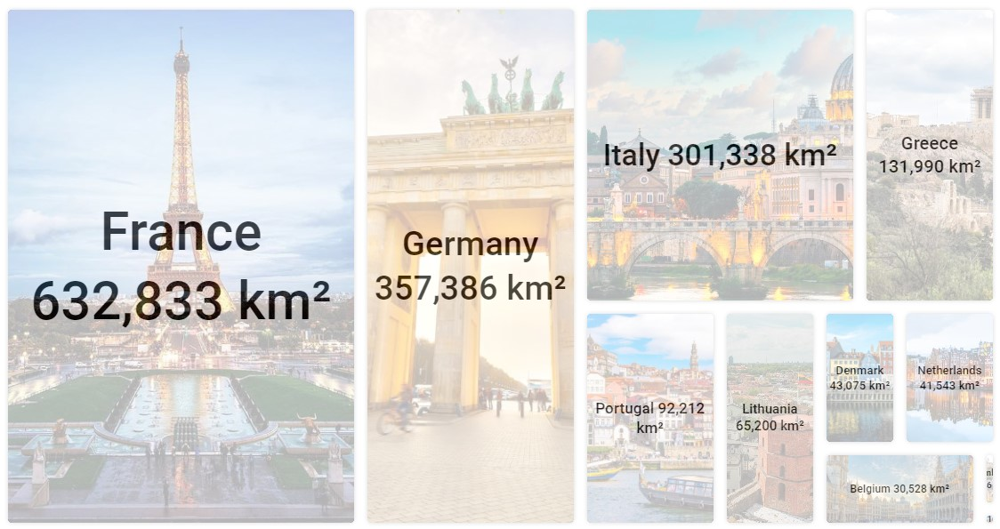
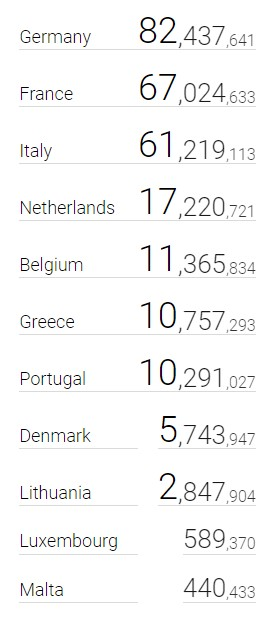

# i2ui

Intuitively Understantable User Interface

<a href="https://www.npmjs.com/package/i2ui">
    
</a>

## Usage

### Installation:

```jsx
npm install i2ui
```

## Glossary

- [Treemap](#treemap)
- [I2Number](#i2number)
- [TagCloud](#tagcloud)
- [Test Data](#test-data)

<br/>

## Treemap

<a href="https://varp.com/treemap" target="_blank">Demo</a>

<div align="center">
    
</div>

Test data is [here](#test-data)
```jsx
import { Treemap } from 'i2ui';
import data from '../test-data';

...

function renderCell(style, record, index) {
    return (<div key={index} style={style}>
        {record.name}
    </div>);
}

...

<Treemap data={data} render={renderCell} dataValueKey="area" />
```

| Name           | Required | Type                                                                            | Description                                                                |
| -------------- | -------- | ------------------------------------------------------------------------------- | -------------------------------------------------------------------------- |
| `dataValueKey` | true     | `string`                                                                        | Value property name (from the item of data)                                |
| `data`         | true     | `any`                                                                           | List of data items                                                         |
| `render`       | true     | `(style: CSSProperties, record: any, index: number, options: any) => ReactNode` | Cell renderer                                                              |
| `maxCells`     | false    | `number`                                                                        | Max cells to display                                                       |
| `minCellValue` | false    | `any`                                                                           | Mix value to display                                                       |
| `size`         | false    | `number`                                                                        | Size of treemap scale. The smaller the simplest treemap is. Default - `30` |
| `mode`         | false    | `emphasize`, 'none'                                                             | When `node`, cards is shown as equal cards. Default - `emphasize`          |
| `className`    | false    | `string`                                                                        | Container's class name                                                     |

<br/>

## I2Number

<a href="http://i2ui.com/#i2number" target="_blank">Live Demo</a>

<div align="center">
    
</div>

Test data is [here](#test-data)

```jsx
import { I2Number } from 'i2ui';
import data from '../test-data';

...

const fromStyle = { fontSize: 16, opacity: 0.6 };
const toStyle = { fontSize: 36, opacity: 1 };
const basicMaxValue = Math.max(...data.map(x => x.population));

...

data.map((record, index)=> {
    return <I2Number key={index} fromStyle={fromStyle} toStyle={toStyle} basicMaxValue={basicMaxValue}>{record.population}</I2Number>
});
```

| Name                | Required | Type                    | Description                                                                                                      |
| ------------------- | -------- | ----------------------- | ---------------------------------------------------------------------------------------------------------------- |
| `value`, `children` | true     | `number`, `string`      | Value                                                                                                            |
| `fromStyle`         | true     | `CSSProperties`         | Part of number's style with lower significance                                                                   |
| `toStyle`           | true     | `CSSProperties`         | Part of number's style with highest significance                                                                 |
| `basicMaxValue`     | false    | `number`, `string`      | Max value to emphasize. Used in set of numbers to be basic. <br/> Actually, this is the max number from the set. |
| `verticalAlign`     | false    | `top`,`center`,`bottom` | Vertical align. Default - `bottom`                                                                               |
| `decimalDigits`     | false    | `number`                | Number of decimal digits. Default is 0                                                                           |
| `groupDigits`       | false    | `number`                | Number of group digits. Default is 3                                                                             |
| `groupSeparator`    | false    | `string`                | Separates groups of digits. Default - `,`                                                                        |
| `decimalSeparator`  | false    | `string`                | Separates decimal part. Default - `.`                                                                            |
| `className`         | false    | `string`                | Container's class name                                                                                           |
| `style`             | false    | `CSSProperties`         | Container's style                                                                                                |
| `prefix`            | false    | `string`                | Text at the beginning                                                                                            |
| `ending`            | false    | `string`                | Text ant the end                                                                                                 |

<br/>

## TagCloud

<a href="https://varp.com/tag-cloud" target="_blank">Demo</a>

<div align="center">
    
</div>

Test data is [here](#test-data)

```jsx
import { TagCloud } from 'i2ui';
import data from '../test-data';

...

const fromStyle = { fontSize: 16, opacity: 0.6 };
const toStyle = { fontSize: 36, opacity: 1 };

function renderTag(style, record, index) {
    return (<div key={index} style={style}>
        {record.name}
    </div>);
}

...

<TagCloud fromStyle={fromStyle} toStyle={toStyle} data={data} render={renderTag} dataValueKey="gdpCapital" />
```

| Name           | Required | Type                                                                            | Description                                 |
| -------------- | -------- | ------------------------------------------------------------------------------- | ------------------------------------------- |
| `dataValueKey` | true     | `string`                                                                        | Value property name (from the item of data) |
| `data`         | true     | `any`                                                                           | List of data items                          |
| `render`       | true     | `(style: CSSProperties, record: any, index: number, options: any) => ReactNode` | Tag renderer                                |
| `fromStyle`    | true     | `CSSProperties`                                                                 | Tag style with lower significance           |
| `toStyle`      | true     | `CSSProperties`                                                                 | Tag style with highest significance         |
| `order`        | false    | `none`, `desc`, `middle`, `asc`, `edge`                                         | Tag's order. Default - `none`               |
| `className`    | false    | `string`                                                                        | Container's class name                      |
| `style`        | false    | `CSSProperties`                                                                 | Container's style                           |

<br/>

### Test Data

```jsx
export default [
  {
    name: "Germany",
    code: "de",
    population: 82437641,
    area: 357386,
    gdpTotal: 3874437,
    gdpCapital: 53567,
  },
  {
    name: "France",
    code: "fr",
    population: 67024633,
    area: 632833,
    gdpTotal: 2833687,
    gdpCapital: 47223,
  },
  {
    name: "Italy",
    code: "it",
    population: 61219113,
    area: 301338,
    gdpTotal: 2147744,
    gdpCapital: 40470,
  },
  {
    name: "Netherlands",
    code: "nl",
    population: 17220721,
    area: 41543,
    gdpTotal: 880716,
    gdpCapital: 58341,
  },
  {
    name: "Belgium",
    code: "be",
    population: 11365834,
    area: 30528,
    gdpTotal: 534230,
    gdpCapital: 49529,
  },
  {
    name: "Greece",
    code: "gr",
    population: 10757293,
    area: 131990,
    gdpTotal: 237970,
    gdpCapital: 30252,
  },
  {
    name: "Portugal",
    code: "pt",
    population: 10291027,
    area: 92212,
    gdpTotal: 340715,
    gdpCapital: 33665,
  },
  {
    name: "Denmark",
    code: "dk",
    population: 5743947,
    area: 43075,
    gdpTotal: 342362,
    gdpCapital: 53882,
  },
  {
    name: "Lithuania",
    code: "lt",
    population: 2847904,
    area: 65200,
    gdpTotal: 48288,
    gdpCapital: 36701,
  },
  {
    name: "Luxembourg",
    code: "lu",
    population: 589370,
    area: 2586,
    gdpTotal: 65683,
    gdpCapital: 108951,
  },
  {
    name: "Malta",
    code: "mt",
    population: 440433,
    area: 316,
    gdpTotal: 10514,
    gdpCapital: 47405,
  },
];
```
