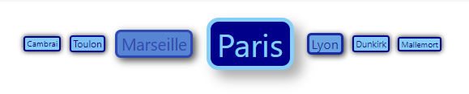
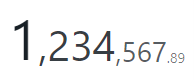

# i2ui

Intuitively Understantable User Interface

<a href="https://www.npmjs.com/package/i2ui">
    
</a>

## Usage

### Installation:

```jsx
npm install i2ui
```

## Glossary

-   [TagCloud](#tagcloud)
-   [I2Number](#i2number)

<br/>

## TagCloud

<a href="http://i2ui.com/#tagcloud" target="_blank">Live Demo</a>

<div align="center">
    
</div>

```jsx
import { TagCloud } from 'i2ui';
...
<TagCloud
    fromStyle={{
        fontSize: 10,
        color: 'DarkBlue',
        backgroundColor: 'LightSkyBlue',
        margin: 5,
        padding: '1px 2px',
        borderRadius: 3,
        border: '2px solid DarkBlue',
        boxShadow: '0 0 6px #111',
    }}
    toStyle={{
        fontSize: 40,
        color: 'LightSkyBlue',
        backgroundColor: 'DarkBlue',
        margin: 10,
        padding: '2px 8px',
        borderRadius: 15,
        border: '5px solid LightSkyBlue',
        boxShadow: '10px 10px 15px #888',
    }}
    order="middle"
    options={[
        { text: 'Paris', rate: 2420069 },
        { text: 'Marseille', rate: 855393 },
        { text: 'Lyon', rate: 500715 },
        { text: 'Toulon', rate: 163760 },
        { text: 'Dunkirk', rate: 89882 },
        { text: 'Cambrai', rate: 32852 },
        { text: 'Mallemort', rate: 5298 },
    ]}
/>
```

| Name           | Required | Type                                                                                                     | Description                                                                                                                    |
| -------------- | -------- | -------------------------------------------------------------------------------------------------------- | ------------------------------------------------------------------------------------------------------------------------------ |
| `options`      | `true`   | `Array<{text: string, rate: number}>`                                                                    | Tags data                                                                                                                      |
| `fromStyle`    | `true`   | `React.CSSProperties`                                                                                    | Tag's style with lower rate                                                                                                    |
| `toStyle`      | `true`   | `React.CSSProperties`                                                                                    | Tag's style with highest rate                                                                                                  |
| `order`        | `false`  | `string`                                                                                                 | Tag's order: `none`(default), `desc`, `middle`, `asc`, `edge`                                                                  |
| `renderOption` | `false`  | (`option: {text: string, rate: number}`,<br/> `style: React.CSSProperties`)<br/> => `React.ReactElement` | Curstom render method for tag. Example: <br> `renderOption={(tagOption, style) => <div style={style}>{tagOption.text} </div>}` |
| `className`    | `false`  | `string`                                                                                                 | Container's class name                                                                                                         |
| `style`        | `false`  | `React.CSSProperties`                                                                                    | Container's style                                                                                                              |

<br/>

## I2Number

<a href="http://i2ui.com/#i2number" target="_blank">Live Demo</a>

<div align="center">
    
</div>

```jsx
import { I2Number } from 'i2ui';
...
<I2Number
    value={1234567.89}
    fromStyle={{ fontSize: '1em', opacity: 0.6 }}
    toStyle={{ fontSize: '4em', opacity: 1 }}
    decimalDigits={2}
/>
```

| Name               | Required | Type                  | Description                                                                                                     |
| ------------------ | -------- | --------------------- | --------------------------------------------------------------------------------------------------------------- |
| `value`            | `true`   | `number`              | Value                                                                                                           |
| `fromStyle`        | `true`   | `React.CSSProperties` | Part of number's style with lower significance                                                                  |
| `toStyle`          | `true`   | `React.CSSProperties` | Part of number's style with highest significance                                                                |
| `basicMaxValue`    | `false`  | `number`              | Max value to empasize. Used in set of numbers to be basic. <br/> Actually, this is the max mumber from the set. |
| `verticalAlign`    | `false`  | `string`              | Vertical align: `top`, `center`, `bottom`(default)                                                              |
| `decimalDigits`    | `false`  | `number`              | Number of decimal digits. Default is 0                                                                          |
| `groupDigits`      | `false`  | `number`              | Number of group digits. Default is 3                                                                            |
| `groupSeparator`   | `false`  | `string`              | Separates groups of digits                                                                                      |
| `decimalSeparator` | `false`  | `string`              | Separates decimal part                                                                                          |
| `className`        | `false`  | `string`              | Container's class name                                                                                          |
| `style`            | `false`  | `React.CSSProperties` | Container's style                                                                                               |
